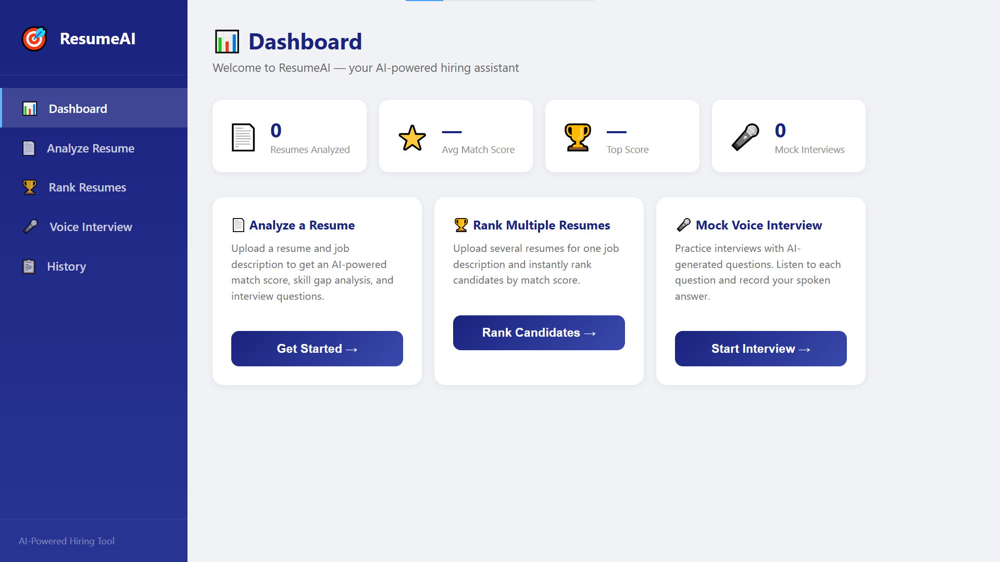

# 🧠 Resume Screener — AI-Powered Resume Screening & Interview Prep Tool

An AI-powered web app that analyzes resumes against job descriptions, detects bias and red flags, checks ATS compatibility, and generates tailored interview questions — built with **Flask**, **NLP**, and **Machine Learning**.

🔗 **Live Demo:** [web-production-a0fa1.up.railway.app](https://web-production-a0fa1.up.railway.app/)

---

## ✨ Features

- **Resume ↔ JD Match Score** — Analyzes a resume against a job description and returns a match percentage with matched/missing skills.
- **JD-Only Analysis** — Upload just a job description to extract required skills, experience level, and market competition insights.
- **Multi-Resume Ranking** — Upload multiple resumes and rank them against a single job description.
- **ATS Compatibility Check** — Scores resumes for Applicant Tracking System friendliness with actionable issues.
- **Bias Detection** — Flags potentially biased language/elements in a resume.
- **Fake Resume Detector** — Flags red flags/warnings and gives an authenticity score.
- **Skill Confidence Meter** — Visualizes how confidently each skill is demonstrated in the resume.
- **AI Interview Question Generator** — Generates role-relevant interview questions using Google's Generative AI.
- **Voice Mock Interview** — Practice interview questions in a mock voice-based interview mode.
- **Improvement Tips** — Personalized suggestions to close skill gaps.
- **Downloadable PDF Report** — Export the full analysis as a PDF report.

---

## 📸 Screenshots

### Dashboard


### Analyse Resume with Job Description


### Analyse Resume Only


### Rank Multiple Resumes


### Skill Confidence Bar


### Other Features (Bias Detection, ATS Score, Authenticity Check)


### Voice Mock Interview


---

## 🛠️ Tech Stack

| Layer | Technology |
|---|---|
| Backend | Flask (Python) |
| AI / NLP | Google Generative AI, scikit-learn |
| PDF Parsing | PyPDF2, pdfplumber |
| Data Handling | pandas |
| Report Generation | ReportLab |
| Frontend | HTML, CSS, JavaScript |
| Deployment | Gunicorn, Railway |

---

## 📂 Project Structure

```
resume-screener/
├── app.py                  # Main Flask application & routes
├── requirements.txt        # Python dependencies
├── Procfile                 # Deployment config (Railway/Heroku)
├── static/                  # CSS, JS, static assets
├── templates/                # HTML templates
├── screenshot/               # App screenshots (used in this README)
└── utils/
    ├── pdf_reader.py              # Extracts text from uploaded resumes
    ├── skill_extractor.py         # Extracts skills/education/experience
    ├── matcher.py                 # Match score & skill gap logic
    ├── ats_checker.py              # ATS compatibility scoring
    ├── bias_detector.py            # Bias detection logic
    ├── fake_resume_detector.py      # Authenticity/red-flag checks
    ├── skill_confidence.py          # Skill confidence calculation
    ├── interview_generator.py       # AI interview Q&A generation
    └── pdf_report.py                # PDF report export
```

---

## 🚀 Getting Started

> Want to try it without setup? Use the **[live demo](https://web-production-a0fa1.up.railway.app/)** instead.

### Prerequisites
- Python 3.8+
- A Google Generative AI (Gemini) API key

### Installation

```bash
# Clone the repo
git clone https://github.com/Aarti-1209/resume-screener.git
cd resume-screener

# Create a virtual environment
python -m venv venv
source venv/bin/activate   # On Windows: venv\Scripts\activate

# Install dependencies
pip install -r requirements.txt
```

### Environment Variables

Create a `.env` file in the root directory:

```
GOOGLE_API_KEY=your_gemini_api_key_here
```

### Run the App

```bash
python app.py
```

The app will be available at `http://localhost:5000`

---

## 🔍 How It Works

1. Upload a resume (PDF) and/or paste a job description.
2. The app extracts text and identifies skills, education, and experience.
3. It calculates a **match score** between the resume and the job description.
4. It runs the resume through **ATS**, **bias**, and **authenticity** checks.
5. It generates **tailored interview questions** and **improvement tips**.
6. You can download the full analysis as a **PDF report**.

---

## 📌 API Endpoints

| Endpoint | Method | Description |
|---|---|---|
| `/` | GET | Renders the home page |
| `/analyze` | POST | Analyzes a resume against a job description |
| `/analyze-jd` | POST | Analyzes a job description only |
| `/rank` | POST | Ranks multiple resumes against a job description |
| `/download-report` | POST | Downloads the analysis as a PDF report |

---

## 🙋‍♀️ Author

**Aarti** — [GitHub: Aarti-1209](https://github.com/Aarti-1209)

---

## 📄 License

This project is open source and available for personal and educational use.
```
